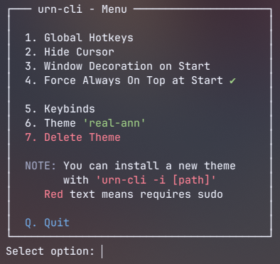

# Urn CLI
A CLI for managing [urn-gtk](https://github.com/paoloose/urn) settings in a userfriendly way.



---

## Dependencies
- Fish Shell
- gsettings
- urn-gtk

# Features
- Toggling: **Global Hotkeys, Hide Cursor, Window Decoration on Start, Force Always On Top By Default**.
- Setting keybinds without manual typing.
- Selecting a installed Theme.
- Deleting a installed Theme.
- Installing a new theme using `-i` argument.

---

## Installation
- #### 1. Clone Repository
```
git clone https://github.com/nukusaba/urn-cli.git
cd urn-cli
```
- #### 2. Install
```
./install.fish
```

- #### 3. Note
  - You may need to relaunch your terminal after installing.
